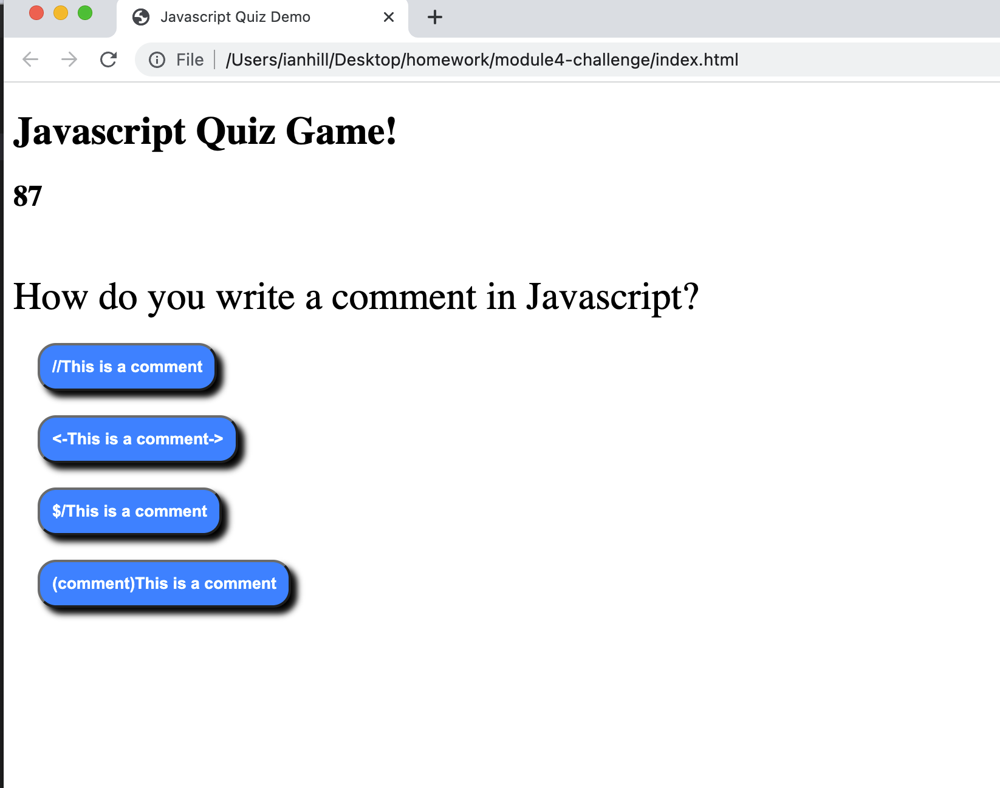

# Module-4-Challenge

Javascript Quiz
This is a timed quiz on Javascript fundamentals that stores high scores. It demonstrates the use of timers, local storage, and events.

When the start button is clicked, the user is presented with a series of questions. If they answer a question incorrectly, time is subtracted from the clock.

When all of the questions are answered, or the timer reaches 0, the game is over.

Users can save their initials and score.

[Module4-challenge link](https://ianahill.github.io/module4-challenge/)